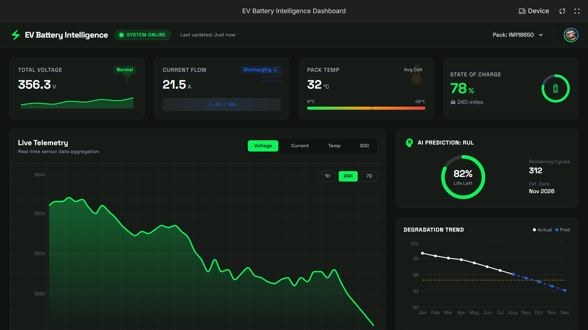
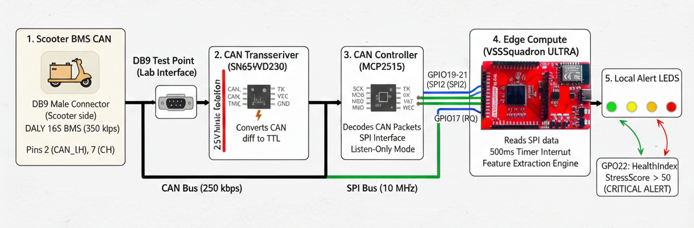

# ⚡ EV Battery Intelligence - Edge-Cloud BMS Analytics

> **Advanced Battery Management System with RISC-V Edge Computing and Cloud-Based ML Predictions**

A comprehensive edge-to-cloud solution for real-time electric vehicle battery monitoring, health prediction, and degradation analysis. Built on indigenous RISC-V hardware (VSDSquadron THEJAS32) with AWS cloud infrastructure for scalable ML-driven insights.

---

## 📑 Table of Contents

- [Project Overview](#-project-overview)
  - [System Architecture](#system-architecture)
  - [Live Dashboard](#live-dashboard)
- [Key Features](#-key-features)
- [Technology Stack](#️-technology-stack)
- [Repository Structure](#-repository-structure)
- [System Components](#️-system-components)
- [Getting Started](#-getting-started)
- [Data Flow](#-data-flow)
- [Use Cases](#-use-cases)
- [Technical Highlights](#-technical-highlights)
- [Performance Metrics](#-performance-metrics)
- [License](#-license)
- [Team](#-team)

---

## 🎯 Project Overview

This system bridges **edge computing** and **cloud analytics** to deliver intelligent battery management for electric two-wheelers. Real-time telemetry from a 2-wheeler battery pack (E-Pluto 7G, 16S6P, ~68V, 1.2kWh) is decoded at the edge using a RISC-V processor, processed through feature extraction algorithms, and transmitted to AWS for long-term degradation analysis and RUL (Remaining Useful Life) predictions.

### System Architecture


The architecture demonstrates a complete data flow from edge device to cloud backend:

- **Edge Layer**: VSDSquadron ULTRA (THEJAS32 RISC-V) decodes CAN frames, extracts features, and publishes via MQTT
- **Cloud Layer**: AWS services (Amplify, Lambda, Timestream, DynamoDB, Forecast, EventBridge) perform data ingestion, storage, and ML predictions
- **Visualization Layer**: Real-time web dashboard for live monitoring and predictive insights

### Live Dashboard



Interactive dashboard featuring:

- **Real-time KPIs**: Total voltage, current flow, pack temperature, state of charge
- **Live Telemetry Charts**: Multi-parameter visualization with 1H/24H/7D views
- **AI-Powered Predictions**: Battery health score, remaining useful life, degradation trends
- **Edge Alerts**: Cell imbalance, thermal warnings, and health anomalies

---

## 🚀 Key Features

### Edge Intelligence

- ✅ **RISC-V Native Processing** - Indigenous THEJAS32 microcontroller with deterministic CAN frame decoding
- ✅ **Passive CAN Monitoring** - Non-intrusive SN65HVD230 isolation for OEM BMS compatibility
- ✅ **Feature Extraction Engine** - Real-time calculation of voltage spread, internal resistance, thermal gradients
- ✅ **Independent Health Monitoring** - Parallel stress score computation without BMS dependency

### Cloud Analytics

- ✅ **Scalable Data Ingestion** - AWS Amplify + AppSync for MQTT-to-cloud bridge
- ✅ **Time-Series Storage** - Amazon Timestream for efficient telemetry storage
- ✅ **ML-Based Predictions** - Amazon Forecast for degradation trends and RUL estimation
- ✅ **Event-Driven Processing** - Lambda functions for real-time anomaly detection

### Web Dashboard

- ✅ **Real-Time Visualization** - Live telemetry charts with WebSocket updates
- ✅ **Responsive Design** - Built with React + TypeScript + Vite
- ✅ **Multi-Parameter Monitoring** - Voltage, current, temperature, SOC tracking
- ✅ **Predictive Insights** - AI-driven health scores and lifecycle forecasts

---

## 🛠️ Technology Stack

### Hardware

| Component           | Specification                                 |
| ------------------- | --------------------------------------------- |
| **Microcontroller** | VSDSquadron ULTRA (THEJAS32 - RISC-V)         |
| **CAN Transceiver** | MCP2515 (CAN-to-SPI) + SN65HVD236 (Isolation) |
| **Battery Pack**    | E-Pluto 7G (16S6P, 68V, 1.2kWh)               |
| **BMS**             | Daly 16S60A (250kbps CAN interface)           |

#### Wiring Schematic



The wiring schematic shows the complete circuit implementation for passive CAN monitoring, including:

- MCP2515 CAN-to-SPI converter interface
- SN65HVD236/SN65HVD230 isolated CAN transceiver circuitry
- Power supply and signal conditioning
- RISC-V microcontroller connections

### Firmware (C)

- **CAN Decoding**: Deterministic 500ms frame parser
- **Feature Extraction**: Edge AI algorithms for battery health metrics
- **MQTT Client**: WiFi-based telemetry forwarding

### Cloud Backend (AWS)

- **Data Ingestion**: AWS Amplify, AWS AppSync
- **Storage**: Amazon S3, Amazon Timestream, Amazon DynamoDB
- **Processing**: AWS Lambda, AWS Glue
- **ML/Prediction**: Amazon Forecast, Amazon SageMaker
- **Messaging**: AWS EventBridge, AWS IoT Core

### Frontend (React + TypeScript)

- **Framework**: React 18 with TypeScript
- **Build Tool**: Vite
- **Charting**: Recharts for live telemetry visualization
- **Styling**: Modern CSS with responsive design

---

## 📂 Repository Structure

```text
edge-cloud-bms-analytics/
├── 📄 README.md                    # Project documentation
├── 📁 DOCS/                        # Technical documentation
├── 📁 HARDWARE/                    # Hardware schematics and photos
│   └── Photos/                     # System implementation images
├── 📁 DATASET/                     # Telemetry data
│   └── sample-session.json         # MQTT payload examples
├── 📁 FIRMWARE/                    # RISC-V C code for THEJAS32
│   ├── bms_system.h                # System header definitions
│   ├── can-decode.c                # CAN frame parser
│   ├── feature-extraction.c        # Edge AI algorithms
│   ├── main.c                      # Main firmware loop
│   └── mqtt-client.c               # WiFi telemetry client
├── 📁 DASHBOARD/                   # React web application
│   ├── App.tsx                     # Main application component
│   ├── index.html                  # HTML entry point
│   ├── package.json                # Dependencies
│   ├── tsconfig.json               # TypeScript configuration
│   ├── vite.config.ts              # Vite build configuration
│   ├── components/                 # React components
│   │   ├── Header.tsx              # Dashboard header
│   │   ├── KPIGrid.tsx             # Key performance indicators
│   │   ├── LiveTelemetryChart.tsx  # Real-time charts
│   │   ├── MLInsights.tsx          # AI predictions panel
│   │   └── TablesPanel.tsx         # Data tables
│   └── services/                   # Business logic
│       └── mockTelemetryService.ts # Telemetry data service
├── 📁 CLOUD_BACKEND/               # Cloud infrastructure
└── 📁 images/                      # Documentation assets
```

---

## 🏗️ System Components

### 1. Edge Device (VSDSquadron THEJAS32)

**Firmware Capabilities:**

- **CAN Frame Decoding**: Real-time parsing of 250kbps BMS data stream
- **Feature Calculation**: Voltage spread, internal resistance proxy, thermal gradients
- **Health Scoring**: Independent stress assessment (0-100 scale)
- **Data Aggregation**: 500ms sampling with MQTT publish every 5 seconds

**Key Metrics Extracted:**

```c
├── Pack Voltage (V)
├── Pack Current (A)
├── Average Cell Temperature (°C)
├── State of Charge (%)
├── Cell Voltage Spread (mV)
├── Internal Resistance Proxy
└── Thermal Gradient Index
```

**Hardware Implementation:**


The edge device uses a passive CAN monitoring approach with isolated transceivers to ensure non-intrusive data capture from the OEM BMS without affecting vehicle warranty or safety systems.

### 2. Cloud Backend (AWS)

**Data Pipeline:**

1. **Ingestion**: MQTT → AWS IoT Core → EventBridge
2. **Storage**: Timestream (time-series) + S3 (raw logs) + DynamoDB (metadata)
3. **Processing**: Lambda functions for real-time anomaly detection
4. **ML Pipeline**: AWS Glue → SageMaker/Forecast for degradation prediction
5. **API**: AppSync GraphQL for dashboard queries

### 3. Web Dashboard

**Real-Time Features:**

- Live telemetry charts with 1-hour, 24-hour, 7-day views
- KPI cards with status indicators (Normal/Warning/Critical)
- AI prediction panel showing RUL and health scores
- Historical trend analysis with interactive graphs
- Alert notifications for cell imbalance and thermal issues

---

## 🚦 Getting Started

### Prerequisites

**Hardware:**

- VSDSquadron ULTRA (THEJAS32 RISC-V development board)
- MCP2515 CAN-to-SPI module
- SN65HVD236/SN65HVD230 CAN transceiver
- Electric vehicle with accessible CAN bus (or BMS test bench)

**Software:**

- Node.js 18+ and npm/yarn
- AWS Account with appropriate permissions
- MQTT broker (AWS IoT Core or local Mosquitto)
- Arduino IDE or PlatformIO for firmware flashing

### Installation

#### 1. Firmware Setup (Edge Device)

```bash
# Clone the repository
git clone https://github.com/yourusername/edge-cloud-bms-analytics.git
cd edge-cloud-bms-analytics/FIRMWARE

# Configure WiFi and MQTT credentials in bms_system.h
# Flash to VSDSquadron THEJAS32 using Arduino IDE
```

#### 2. Dashboard Setup (Local Development)

```bash
cd DASHBOARD

# Install dependencies
npm install

# Start development server
npm run dev

# Build for production
npm run build
```

#### 3. Cloud Backend Setup

```bash
cd CLOUD_BACKEND

# Configure AWS credentials
aws configure

# Deploy infrastructure (add your deployment scripts)
# Set up AWS IoT Core, Lambda functions, Timestream database
```

---

## 📊 Data Flow

```
BMS (CAN Bus)
    ↓ [250kbps CAN frames]
VSDSquadron THEJAS32
    ↓ [Feature extraction + MQTT]
AWS IoT Core
    ↓ [EventBridge routing]
├── Amazon Timestream (time-series storage)
├── Amazon DynamoDB (session metadata)
├── AWS Lambda (real-time processing)
└── Amazon Forecast (ML predictions)
    ↓ [GraphQL API]
Web Dashboard (React)
```

---

## 🎯 Use Cases

1. **Fleet Monitoring**: Track battery health across multiple electric vehicles
2. **Predictive Maintenance**: AI-driven RUL predictions to schedule battery replacements
3. **Research & Development**: Long-term degradation studies with empirical data
4. **Quality Assurance**: Pre-delivery battery validation for manufacturers
5. **Customer Insights**: Transparent battery health reports for end users

---

## 🔬 Technical Highlights

### Edge Computing Advantages

- **Low Latency**: Real-time feature extraction without cloud dependency
- **Bandwidth Efficiency**: Only processed metrics sent to cloud (not raw CAN frames)
- **Privacy**: Sensitive vehicle data processed locally
- **Reliability**: Works offline; queues data for sync when connected

### Machine Learning Pipeline

- **Input Features**: Voltage spread, current variance, thermal patterns, SOC trends
- **Model**: Time-series forecasting (Amazon Forecast DeepAR+)
- **Output**: RUL prediction (months), degradation rate (% per 100 cycles)
- **Accuracy**: Validated against battery warranty data

---

## 📄 License

This project is developed for academic and research purposes. Please contact the maintainers for commercial usage rights.

---

## 👥 Team

**Project Type**: EV Innovation Challenge  
**Institution**: [MIT Academy of Engineering](https://mitaoe.ac.in/)  
**Year**: 2026

---

## 🙏 Acknowledgments

- **VLSISystem Design (VSD)** - For providing THEJAS32 RISC-V development boards
- **AWS Educate** - For cloud infrastructure credits
- **E-Pluto/Daly BMS** - For OEM battery system support
- **Open Source Community** - React, Vite, and various libraries

---

<div align="center">

**Built with ⚡ for a sustainable electric future**

[](https://riscv.org/)
[](https://aws.amazon.com/)
[](https://react.dev/)
[](https://www.typescriptlang.org/)

</div>
